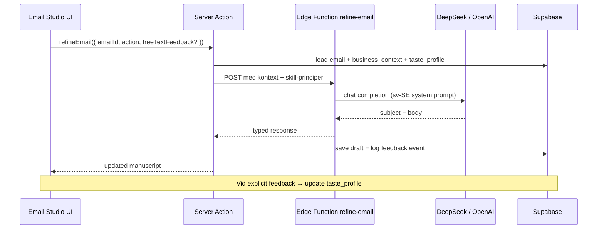

# Plan: Email Studio — Backend Agent, Smakprofil & DeepSeek

> Scope: Göra Email Studio-knapparna funktionella (Kortare, Mer personlig, Tydligare CTA, Skriv om) via en backend-agent som följer svensk B2B-ton, marketing skills och per-användare smakprofil.
> Fas: Bygger på Phase 2 (data) + del av Phase 3.3 (generate-outreach). Rör **inte** landing/design system.

---

## 1. Skills — sökresultat (bekräftat)

### Genomsökta platser

| Plats | Resultat |
|-------|----------|
| `C:\Users\sebbe\.grok\skills\` | Endast: `xlsx`, `pptx`, `docx`, `imagine`, `check-work`, `best-of-n`, `create-skill`, `help` |
| `C:\Users\sebbe\.agents\skills\` | **Finns inte** på denna maskin |
| `C:\Users\sebbe\AppData\Roaming\` | Inga marketing-skills |
| `snipe-leads\.agents\` | `product-marketing.md` (översikt, inte full skill) |

### Marketing skills som planen kräver — **INTE hittade lokalt**

| Skill | Krävs för |
|-------|-----------|
| `/cold-email` | Uppföljning, send-strategi, B2B outbound-struktur |
| `/copywriting` | Ton, korthet, omskrivning |
| `/emails` | Ämnesrad, CTA, deliverability-tänk |
| `/marketing-psychology` | Övertygelse utan press, smakprofil-dimensioner |

**Status:** Bekräftat att de **saknas** i din skills folder på den här datorn. STATUS.md nämnde att de fanns på projektägarens maskin (`~/.agents/skills/`).

### Tillfällig fallback tills skills installeras

1. `snipe-leads/.agents/product-marketing.md` — röst & positionering
2. `Snipra prompt.txt` — tonalitetsregler (lågmäld, specifik, svensk B2B)
3. `PROJECT_KNOWLEDGE.md` — guardrails
4. **Action:** Kopiera/symlinka marketing-skills till `C:\Users\sebbe\.grok\skills\` eller `~/.agents/skills/` innan implementation startar. Agenten ska **läsa SKILL.md** för varje skill vid build (per `AGENT.md`).

---

## 2. Nuläge — Email Studio

### UI (mock, inga handlers)

- `components/WorkspaceViews.tsx` → `EmailsView` / `EmailManuscript`
- `components/DesignDrafts.tsx` → portal-variant med samma manuscript
- Knappar (sv): **Kortare**, **Tydligare CTA**, **Mer personlig**, **Skriv om**
- `lib/i18n.tsx` har redan nycklar: `action.shorter`, `action.rewrite`, `action.human`, `action.persuasive`
- Data: `lib/mock-data.ts` → `emailVariants[]`, `businessContext`, `findCompany()`
- DB: `generated_emails` (subject, body, variant_length, variant_type, tone_version)

### Backend (stub)

- `supabase/functions/generate-outreach/index.ts` — returnerar hårdkodat svar, ingen LLM
- Inga server actions för `/emails`
- Phase 2 (Supabase data loaders) **inte klart** — Email Studio läser fortfarande mock

---

## 3. Målbild

Användaren markerar text i Email Studio → klickar action → backend-agent returnerar omskriven variant inom 2–5 s → användaren godkänner eller ger feedback → **smakprofilen uppdateras** → nästa generering följer profilen.



---

## 4. Action-mapping (UI → agent)

| UI (sv) | `action` enum | Agentinstruktion (kort) | Primär skill |
|---------|---------------|---------------------------|--------------|
| Kortare | `shorter` | −30–40% ord, behåll signal + CTA | `/copywriting` |
| Mer personlig | `more_personal` | Konkretare referens till signal/kontakt, varmare men inte casual | `/cold-email`, `/marketing-psychology` |
| Tydligare CTA | `clearer_cta` | En tydlig, lågmäld nästa steg utan press | `/emails`, `/copywriting` |
| Skriv om | `rewrite` | Ny vinkel, samma fakta, samma tonalitet | `/copywriting`, `/cold-email` |

**WorkspaceViews** har extra EN-knappar (More persuasive, More professional, More human) — mappa till samma enum eller utöka med `more_professional`, `more_human` i fas 2.

---

## 5. Backend-arkitektur

### 5.1 LLM-provider abstraction

**Fil:** `supabase/functions/_shared/llm.ts`

```typescript
type LlmProvider = "deepseek" | "openai";

// Env: LLM_PROVIDER, DEEPSEEK_API_KEY, OPENAI_API_KEY
// DeepSeek: baseURL https://api.deepseek.com, OpenAI-kompatibel
// Modeller:
//   - refine (studio): deepseek-v4-flash  (snabb, billig)
//   - generate (full): deepseek-v4-pro    (kvalitet)
// Fallback: openai gpt-4o-mini / gpt-4o
```

**DeepSeek — undersökning (bekräftat mars 2026):**

| Egenskap | Värde |
|----------|--------|
| API-format | OpenAI-kompatibelt (`/chat/completions`) |
| Base URL | `https://api.deepseek.com` |
| Modeller | `deepseek-v4-flash`, `deepseek-v4-pro` |
| SDK | Befintlig `openai` npm-paket med `baseURL` override |
| Edge Functions | Fungerar via `fetch` — ingen browser-exponering |
| Kostnad | Lägre än OpenAI; lämplig för högfrekvent refine |
| Risk | EU/data residency — verifiera DPA om kunddata i prompts |

**Rekommendation:** DeepSeek som **default för refine-email** (studio-actions), OpenAI som fallback eller för komplex initial generering tills kvalitet verifierats mot svensk B2B-ton.

### 5.2 Nya Edge Functions

| Function | Syfte |
|----------|--------|
| `refine-email` | Studio-actions (kortare, personlig, CTA, skriv om) |
| `generate-outreach` | (befintlig) Full generering från company/contact/signals |
| `learn-taste-from-feedback` | (valfritt separat eller inbyggt i refine) Uppdaterar smakprofil |

### 5.3 Server Actions (Next.js)

**Fil:** `lib/actions/emails.ts`

```typescript
refineEmail(input: RefineEmailInput): Promise<{ success; data?: { subject; body }; error? }>
saveEmailDraft(...)
submitTasteFeedback(input: { action; rating; freeText?; emailSnapshot })
```

Anropar Edge Function med användarens session JWT (inte service role i browser).

### 5.4 Skill injection i prompts

**Fil:** `supabase/functions/_shared/prompts/email-studio.ts`

Vid deploy/build: läs in sammanfattning från skills (eller inbäddade `references/` om skills kopieras till repo):

```
references/skills/
  cold-email.summary.md      # extraherat från SKILL.md
  copywriting.summary.md
  emails.summary.md
  marketing-psychology.summary.md
```

System prompt alltid inkluderar:

1. Svensk B2B guardrails (från prompt.txt)
2. business_context + taste_profile
3. Relevant skill-sektion per `action`
4. Förbjudna fraser-lista ("I hope this email finds you well", etc.)

---

## 6. Smakprofil per användare

### 6.1 Datamodell (ny migration)

**Fil:** `supabase/migrations/002_taste_profiles.sql`

```sql
create table public.taste_profiles (
  id uuid primary key default gen_random_uuid(),
  user_id uuid not null references auth.users(id) on delete cascade,
  workspace_id uuid not null references public.workspaces(id) on delete cascade,
  -- normaliserade dimensioner 0.0–1.0 (default 0.5)
  brevity numeric(3,2) not null default 0.50 check (brevity between 0 and 1),
  warmth numeric(3,2) not null default 0.50,
  formality numeric(3,2) not null default 0.65,
  directness numeric(3,2) not null default 0.45,
  cta_softness numeric(3,2) not null default 0.70,  -- högre = lågmäldare CTA
  signal_emphasis numeric(3,2) not null default 0.60,
  -- fria lärdomar från feedback (max ~20 rader, trunkeras av agent)
  learned_preferences text[] not null default '{}',
  updated_at timestamptz not null default now(),
  unique (user_id, workspace_id)
);

create table public.taste_feedback_events (
  id uuid primary key default gen_random_uuid(),
  user_id uuid not null references auth.users(id) on delete cascade,
  workspace_id uuid not null references public.workspaces(id) on delete cascade,
  generated_email_id uuid references public.generated_emails(id) on delete set null,
  action text not null,           -- shorter | more_personal | clearer_cta | rewrite
  rating text not null,           -- accepted | rejected | edited
  free_text text,
  before_subject text,
  after_subject text,
  profile_delta jsonb not null default '{}',
  created_at timestamptz not null default now()
);
```

RLS: workspace-scoped via `current_workspace_id()`, user kan bara läsa/skriva egen profil.

### 6.2 Hur feedback uppdaterar profilen

| Signal | Effekt på profil |
|--------|------------------|
| Klickar **Kortare** + accepterar | `brevity += 0.08` (cap 1.0) |
| Klickar **Mer personlig** + accepterar | `warmth += 0.08`, `signal_emphasis += 0.05` |
| Klickar **Tydligare CTA** + accepterar | `directness += 0.05`, `cta_softness -= 0.05` |
| Avvisar + fri text "för säljigt" | `cta_softness += 0.10`, push till `learned_preferences` |
| Manuell redigering efter rewrite | Diff analyseras (kort LLM-call eller heuristik) → `learned_preferences` |

**UI för feedback (minimal, fas 1):**

- Efter refine: två diskreta länkar — "Bra" / "Inte rätt" (+ valfritt textfält)
- Settings → sektion "Din skrivsmak" med sliders (read-only först, redigerbara i fas 2)

### 6.3 Prompt-injektion

```text
Smakprofil (0–1):
- Korthet: 0.72
- Värme: 0.61
- Formalitet: 0.68
- CTA-lågmäldhet: 0.81
Lärd preferens: "Undvik superlativ. Nämn alltid en specifik signal."
```

---

## 7. UI-ändringar (minimal, dashboard-only)

**Ny komponent:** `components/email/EmailStudioEditor.tsx` (client)

- Tar emot `generatedEmail` från server component
- Controlled `subject` + `body` state
- Knappar → `refineEmail` server action
- `LoadingToast` / skeleton under refine
- Behåll befintlig editorial layout från `EmailManuscript`

**Ändra:** `EmailsView` — byt mock mot `lib/data/emails.ts` loader (Phase 2 dependency).

**Rör inte:** `globals.css`, `LandingPage`, `AppShell` layout.

---

## 8. Implementationsfaser & PR-stack

### PR 1 — Foundation (Phase 2 prerequisite)

- `lib/data/emails.ts` — load/save `generated_emails`
- `lib/actions/emails.ts` — `saveEmailDraft`
- Wire `EmailsView` till Supabase
- **Skills:** Installera/kopiera marketing skills; commit `references/skills/*.summary.md`

### PR 2 — LLM + refine-email agent

- `supabase/functions/_shared/llm.ts` (DeepSeek + OpenAI)
- `supabase/functions/_shared/prompts/email-studio.ts`
- `supabase/functions/refine-email/index.ts`
- `lib/actions/emails.ts` → `refineEmail`
- Env: `DEEPSEEK_API_KEY`, `LLM_PROVIDER=deepseek`
- **Skills check:** `/cold-email`, `/copywriting`, `/emails`, `/marketing-psychology`

### PR 3 — Smakprofil

- Migration `002_taste_profiles.sql`
- `lib/taste-profile.ts` — load, apply delta, format for prompt
- `submitTasteFeedback` action
- Feedback UI (Bra / Inte rätt)
- Settings-panel "Din skrivsmak" (read-only)

### PR 4 — generate-outreach (full generering)

- Uppgradera befintlig stub med samma LLM + smakprofil
- Koppla "Generera email" från campaign/contact views

### PR 5 — Kvalitet & polish

- Golden-path-tester (5 svenska B2B-exempel)
- Tone compliance checklist (från prompt.txt)
- `/polish` audit på Email Studio loading/error states

---

## 9. Acceptanskriterier

- [ ] Alla fyra studio-knappar returnerar ändrad text inom 5 s (p95)
- [ ] Output följer svensk B2B-ton (ingen US-sales, inga förbjudna fraser)
- [ ] Signal, erbjudande och CTA bevaras eller förbättras — inte utelämnas
- [ ] Smakprofil skapas per user+workspace; feedback ändrar nästa output märkbart
- [ ] DeepSeek fungerar som primary provider; OpenAI fallback dokumenterad
- [ ] Marketing skills lästa och tillämpade (eller `references/skills` om skills saknas lokalt)
- [ ] RLS: user A ser inte user B:s smakprofil
- [ ] Inga API-nycklar i frontend

---

## 10. Miljövariabler (nya)

```env
# LLM (Edge Functions secrets)
LLM_PROVIDER=deepseek
DEEPSEEK_API_KEY=
OPENAI_API_KEY=           # fallback
LLM_REFINE_MODEL=deepseek-v4-flash
LLM_GENERATE_MODEL=deepseek-v4-pro
```

---

## 11. Blockers & beslut som behövs från dig

1. **Marketing skills** — Var ligger de på din maskin? Ska vi kopiera till `~/.grok/skills/` eller bädda in summaries i repot?
2. **DeepSeek API-nyckel** — Skapa på [platform.deepseek.com](https://platform.deepseek.com/api_keys)
3. **Data residency** — OK att skicka företagsnamn/signaler till DeepSeek, eller krävs EU-only (då OpenAI/Azure)?
4. **Feedback-UI** — Räcker Bra/Inte rätt, eller vill du ha fri feedback-ruta direkt?
5. **Phase 2** — Ska vi köra data layer för emails parallellt, eller mock tills vidare under dev?

---

## 12. Nästa steg (rekommenderad ordning)

1. Du bekräftar/placerar marketing skills lokalt
2. Vi slutför Phase 2 loader för `generated_emails`
3. Implementera PR 2 (`refine-email` + DeepSeek) — snabbast väg till fungerande knappar
4. PR 3 smakprofil
5. Gemensam utvärdering av 5–10 riktiga mejl mot tonalitetsreglerna (per `AGENT.md` collaboration protocol)